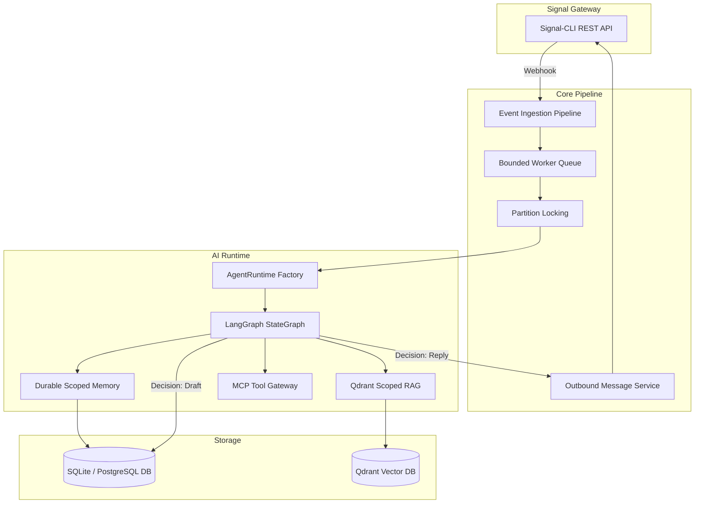

<div align="center">

# 🤖 Signal Market Bot

### Signal-native AI Agent Platform for Customer Support & Conversational Commerce

<p align="center">
  A production-oriented AI agent platform bridging <strong>Signal messaging</strong> with <strong>LangGraph stateful agents</strong>, <strong>scoped RAG retrieval</strong> (Qdrant), <strong>extensible MCP tools</strong>, <strong>human-in-the-loop Copilot</strong> review, and <strong>deep runtime observability</strong> for customer support and conversational commerce.
</p>

[](https://github.com/yuanweize/signal-market-bot/releases)
[](https://github.com/yuanweize/signal-market-bot/actions)
[](https://github.com/yuanweize/signal-market-bot/pkgs/container/signal-market-bot-backend)
[](backend/pyproject.toml)
[](frontend/package.json)
[](LICENSE)

[English](README.md) • [简体中文](README.zh-CN.md) • [Documentation](docs/ARCHITECTURE.md) • [Release Notes](CHANGELOG.md)

</div>

---

<div align="center">
  
  <p><em>Signal Market Bot Executive Console — Real-time operational telemetry, messaging volume, module health, and catalog metrics</em></p>
</div>

<div align="center">
  
  <p><em>AI Studio Observability & Operations Console — Truthful token telemetry, latency percentiles, structured usage breakdown, and 4-group management workflow</em></p>
</div>

### 📸 Product Tour

<table>
  <tr>
    <td width="50%" align="center">
      
      <br><strong>Runs & Trace Inspector</strong><br><em>Slide-over execution inspector with per-call model telemetry & token breakdown</em>
    </td>
    <td width="50%" align="center">
      
      <br><strong>Inbox Copilot & Takeover</strong><br><em>Human-in-the-loop assisted draft review, provenance tracking, and takeover controls</em>
    </td>
  </tr>
  <tr>
    <td width="50%" align="center">
      
      <br><strong>Runtime AI Engine Settings</strong><br><em>Universal OpenAI-compatible configuration, model probing, and encrypted storage</em>
    </td>
    <td width="50%" align="center">
      
      <br><strong>Targeted Broadcast Campaigns</strong><br><em>Smart group broadcasting composer with dry-run verification and delivery analytics</em>
    </td>
  </tr>
</table>

---

## 🌟 Overview

**Signal Market Bot** is a **Signal-native AI customer service and conversational commerce platform** designed specifically for the Signal messaging ecosystem. It bridges end-to-end Signal messaging with modern LLM intelligence, human agent intervention, e-commerce catalog management, and automated broadcast campaigns.

With **AI Platform v0.4**, the system introduces an agentic architecture powered by **LangGraph**, offering **Copilot mode with message provenance**, **Progressive Skills**, **Scoped RAG retrieval with cross-tenant isolation**, **Durable Scoped Memory**, **MCP tool governance**, and a **Human-in-the-Loop continuous learning loop**.

---

## 🚀 Key Features

### 🤖 AI Platform & Agent Runtime (v0.4)
- **LangGraph Agent Workflow**: Directed state graph executing progressive skill discovery, multi-scope RAG, tool authorization, grounded generation, and decision classification (`reply`, `draft_for_human`, `handoff`, `no_reply`).
- **Production Runtime Factory**: Eliminates silent fallback to fake providers in production. Production deployments connect directly to live OpenAI-compatible LLM/Embedding endpoints and Qdrant vector database.
- **Strict Group Privacy Invariant (P0)**: Group chat conversations are strictly forbidden from retrieving private user documents or loading private user memories.
- **Inbox Copilot Mode**: Real-time drafting assistant for human operators with one-click **Accept & Send**, **Edit in Composer**, **Discard**, and an **Evidence Drawer** revealing citations, memories, and tools used.
- **Message Provenance Tracking**: Strict origin classification (`customer`, `ai_auto`, `human_ai_assisted`, `human_manual`, `system`, `campaign`) linked to `ai_run_id` for explainable AI auditing.
- **Scoped RAG Knowledge Base**: Qdrant vector storage with point UUID mapping, dense retrieval, and full relational-to-vector reindexing (`POST /api/ai-studio/knowledge/reindex`).
- **Durable Scoped Memory**: Automated customer preference extraction bound to canonical user identity (phone number & Signal UUID map to the same namespace) with individual deletion support.
- **Governed Tools & Model Context Protocol (MCP)**: Official Python `mcp` SDK stdio client integration. Sensitive tools (e.g. refunds) trigger supervisor drafts (`draft_for_human`) rather than autonomous execution.
- **Human-in-the-Loop Learning Loop**: Detects operator edits, curates learning candidates, allows one-click FAQ promotion, and exports fine-tuning JSONL datasets.
- **Deterministic Contract Evaluation**: 32-case deterministic evaluation suite (`python evals/run_evals.py`) scoring pass rate, decision accuracy, keyword recall, and latency passing in CI.

### 🎛️ AI Studio Observability & Operations Console
- **Truthful Runtime Telemetry**: Dashboard metrics, component status badges, and token usage reflect real runtime diagnostics rather than decorative mock values.
- **Provider-Neutral Token Telemetry**: Complete token breakdowns (`input`, `output`, `cached`, `reasoning`) and realistic pricing estimation with fallback for unconfigured models.
- **Hierarchical Information Architecture**: Streamlined 4-group workflow: **Operate** (Overview, Runs & Traces, Diagnostics), **Knowledge** (RAG Knowledge, Memory, Skills), **Automation** (Tools & MCP), and **Improve** (Learning Loop, Prompts, Evaluations).
- **Runs & Model-Call Trace Explorer**: Full execution tracing with decision/error filters, token inspection, and per-turn model call breakdown (`ai_model_calls`).
- **Interactive Live Diagnostics**: Instant probe testing for live LLM providers verifying connection latency, tool execution, embeddings, and token consumption.
- **Golden Evaluation Suite**: Persisted evaluation runs with dual-mode benchmark support (32 deterministic invariant test cases + configurable live LLM evaluations).

> [!NOTE]
> **Demo Data vs. Live Telemetry**: Safe synthetic demo data can be populated using `python backend/scripts/seed_demo_data.py` to preview the AI Studio dashboard and Inbox experience in local developer environments. In live deployments, all metrics and traces are strictly produced by actual runtime executions.

### 📥 Support Inbox & Takeover
- **Dual-Pane Conversation Console**: Complete customer conversation visibility with unread counters, message search, and type filters (DMs / Groups / Unread).
- **4-State Takeover Engine**: Seamlessly toggle between **Auto (AI)**, **Copilot (Assisted Drafts)**, **Manual (Human Only)**, and **Paused (Mute)** with pre-send state locks.
- **Delivery State Machine**: Comprehensive message lifecycle tracking (`received` / `pending` -> `sent` / `failed` -> `delivered` -> `read`) with one-click failed message retries.
- **Media & Reactions**: Native parsing and rendering of media attachments and emoji reactions.

### ⚡ Resilient Event Ingestion Pipeline
- **Backpressure-Controlled Queue**: Bounded in-memory event pipeline (`maxsize=1000`) preventing memory spikes during message surges.
- **Concurrent Worker Pool**: Multi-worker asynchronous processing with per-conversation partition locking to guarantee strict chronological message order without blocking unrelated chats.
- **Robust Deduplication**: Dual-layer deduplication combining fast LRU in-memory filtering with database unique constraints across reconnect cycles.

### 📢 Targeted Campaign Broadcasts
- **Smart Group Broadcasting**: Disseminate announcements and updates to selected Signal groups.
- **Policy Guardrails**: Built-in quiet hours protection, group blacklisting, and a zero-risk dry-run preview mode.

### 🔒 Operational Security & Zero-.env Configuration
- **First-Run Security Bootstrap**: One-time setup wizard configuring administrative credentials with scrypt password hashing and optional TOTP 2FA.
- **Encrypted Runtime Configuration**: Configure Signal gateways, AI API keys, retention periods, and prompts directly in the UI with automated credential masking and encrypted DB storage.
- **Comprehensive Audit Trail**: Structured event logging recording authentication attempts, takeover actions, and configuration updates.

---

## 📚 Technical Documentation

- 🏛️ [System Architecture & Data Flows](docs/ARCHITECTURE.md)
- 🤖 [AI Platform Subsystems & Runtime Factory](docs/AI_PLATFORM.md)
- 🔒 [Security & Privacy Invariants](docs/SECURITY_PRIVACY.md)
- 🧪 [Testing Architecture & Verification Matrix](docs/TESTING.md)
- 🗺️ [Product Roadmap](docs/ROADMAP.md)
- 🔄 [Database Migration Guide (Alembic)](docs/MIGRATION.md)
- 🔌 [Signal Gateway API Contract & Webhooks](docs/SIGNAL_API_CONTRACT.md)
- 📱 [Real Signal Environment Validation Guide](docs/REAL_SIGNAL_VALIDATION.md)
- 🔍 [v0.4 Reality Audit Report](docs/releases/v0.4.0-audit.md)

---

## 🏗️ Architecture



---

## 🛠️ Local Development

### Backend Setup

```bash
cd backend

# Create and activate virtual environment
python3 -m venv .venv
source .venv/bin/activate

# Install dependencies in editable mode
pip install -e ".[dev]"

# Run test suite and lint checks
pytest tests/ -v
ruff check app tests evals
ruff format --check app tests evals

# Run deterministic agent contract evaluation suite (32 cases)
python evals/run_evals.py

# Launch development server
uvicorn app.main:app --reload --port 8000
```

### Frontend Setup

```bash
cd frontend

# Install Node dependencies
npm ci

# Run component test suites and linter
npm test
npm run lint
npx tsc --noEmit
npm run build

# Start development server with HMR
npm run dev
```

---

## 📊 Technical Specifications

| Layer | Technologies |
|---|---|
| **Backend Framework** | [FastAPI](https://fastapi.tiangolo.com/) 0.115+ (Asynchronous Python 3.12) |
| **Agent Orchestration**| [LangGraph](https://github.com/langchain-ai/langgraph) + StateGraph + Progressive Skills |
| **Vector Store** | [Qdrant](https://qdrant.tech/) via official `qdrant-client` 1.10+ (`query_points`) |
| **Tool Protocol** | Official [Model Context Protocol (MCP)](https://modelcontextprotocol.io/) Python SDK 2.x |
| **ORM & Database** | [SQLAlchemy](https://www.sqlalchemy.org/) 2.0 (AsyncIO) + [aiosqlite](https://github.com/omnilib/aiosqlite) (SQLite production-tested, PostgreSQL on roadmap) + [Alembic](https://alembic.sqlalchemy.org/) linear migrations |
| **Frontend Stack** | [React](https://react.dev/) 18 + [Vite](https://vitejs.dev/) + [TypeScript](https://www.typescriptlang.org/) + [React Router](https://reactrouter.com/) 7.18+ |
| **Styling System** | [Tailwind CSS](https://tailwindcss.com/) + [DaisyUI](https://daisyui.com/) |
| **Security & Auth** | Scrypt KDF + Fernet DB secret encryption + [PyOTP](https://github.com/pyauth/pyotp) (TOTP 2FA) + [python-jose](https://github.com/mpdavis/python-jose) (JWT) |
| **Quality Gates** | [pytest](https://docs.pytest.org/) (141 passing tests) + [Vitest](https://vitest.dev/) (20 passing tests across 6 files) + Deterministic AI eval (32 cases) + Migration lifecycle (5/5) + Docker Compose runtime smoke ([Details](docs/TESTING.md)) |
| **Deployment** | Docker multi-stage builds + Docker Compose + GitHub Container Registry (GHCR) |

---

## 📄 License

This project is open-source software licensed under the [MIT License](LICENSE).
