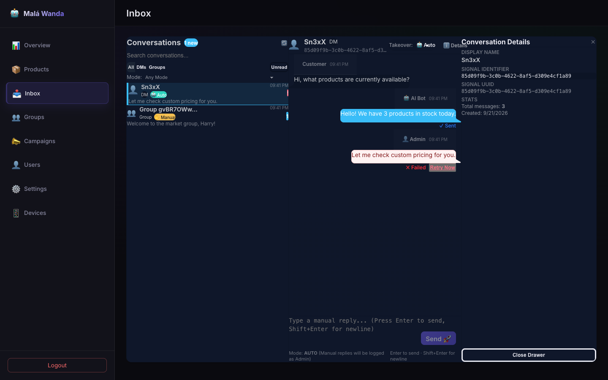
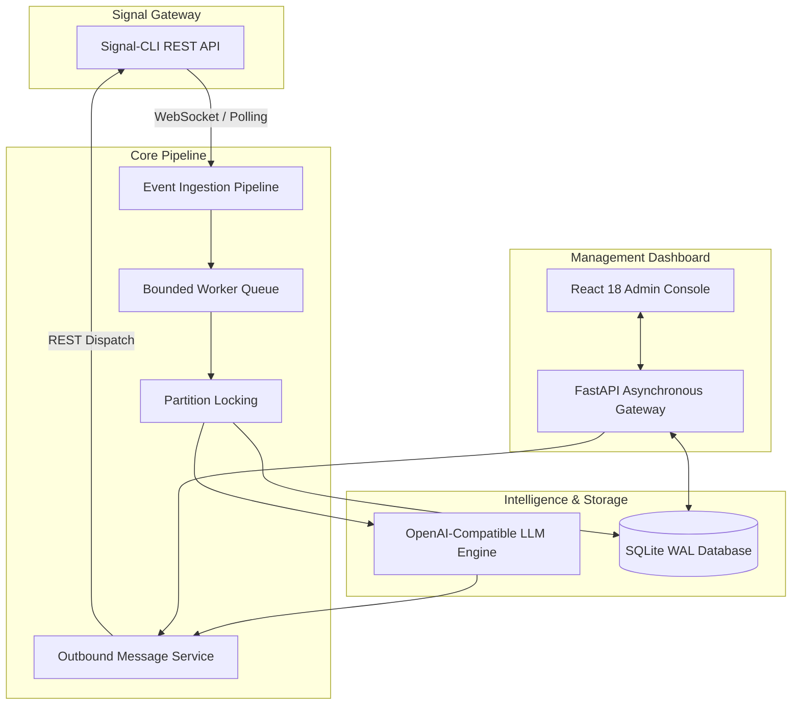

<div align="center">

# 🤖 Signal Market Bot

### Production-Grade Conversational Commerce & AI Customer Support Platform for Signal

[](https://github.com/yuanweize/signal-market-bot/releases)
[](https://github.com/yuanweize/signal-market-bot/actions)
[](https://github.com/yuanweize/signal-market-bot/pkgs/container/signal-market-bot-backend)
[](backend/pyproject.toml)
[](frontend/package.json)
[](LICENSE)

[English](README.md) • [简体中文](README.zh-CN.md) • [Documentation](docs/ARCHITECTURE_CURRENT.md) • [Release Notes](CHANGELOG.md)

</div>

---

<div align="center">
  
  <p><em>Signal Market Bot Executive Console — Real-time operational telemetry, messaging volume, marketing broadcasts, and product metrics</em></p>
</div>

<div align="center">
  
  <p><em>Modern Dual-Pane Support Inbox — Real-time conversations, AI/Human takeover switcher, optimistic dispatch, and delivery state tracking</em></p>
</div>

<div align="center">
  
  <p><em>Runtime AI Engine Configuration — Universal OpenAI-compatible endpoint integration, temperature tuning, dynamic prompt injection, and hot reloading</em></p>
</div>

---

## 🌟 Overview

**Signal Market Bot** is a high-performance, enterprise-grade conversational commerce and customer automation platform designed specifically for the Signal messaging ecosystem. It seamlessly bridges end-to-end Signal messaging with modern LLM intelligence, human agent intervention, e-commerce catalog management, and automated broadcast campaigns.

Built on an asynchronous **FastAPI** backend and a reactive **React + Tailwind + DaisyUI** admin dashboard, Signal Market Bot eliminates fragile `.env`-based operational friction by providing a self-contained, DB-backed runtime configuration console with bank-grade security controls.

---

## 🚀 Key Features

### 🧠 Pluggable AI Intelligence
- **Universal Provider Compatibility**: Seamlessly connect OpenAI, DeepSeek, Ollama, vLLM, LocalAI, Azure OpenAI, or any OpenAI-compatible endpoint.
- **Dynamic Context Injection**: Grounded bot responses incorporating live product inventory, customer conversation history, and tailored domain instructions.
- **Conversation State Awareness**: Intelligent group context handling attributing messages to specific senders while preventing redundant prompt echoes.

### 📥 Real-Time Support Inbox & Takeover
- **Dual-Pane Conversation Console**: Complete customer conversation visibility with unread counters, message search, and type filters (DMs / Groups / Unread).
- **Concurrency-Safe Manual Takeover**: Instantly toggle between **Auto (AI)**, **Manual (Human)**, and **Paused (Mute)**. Includes pre-send state verification that automatically discards stale AI outbound messages if an agent takes over mid-generation.
- **Delivery State Machine**: Comprehensive message lifecycle tracking (`received` / `pending` -> `sent` / `failed` -> `delivered` -> `read`) with one-click failed message retries.
- **Rich Media & Reactions**: Native parsing and rendering of media attachments and emoji reactions.

### ⚡ Resilient Event Ingestion Pipeline
- **Backpressure-Controlled Queue**: Bounded in-memory event pipeline (`maxsize=1000`) preventing memory spikes during message surges.
- **Concurrent Worker Pool**: Multi-worker asynchronous processing with per-conversation partition locking to guarantee strict chronological message order without blocking unrelated chats.
- **Robust Deduplication**: Dual-layer deduplication combining fast LRU in-memory filtering with database unique constraints across reconnect cycles.

### 👥 Identity Resolution & Group Membership
- **Unified Identity System**: Resolves Signal UUIDs and E.164 phone numbers to a single canonical customer record.
- **Group Roster Synchronization**: Dynamic group synchronization tracking participant rosters, member roles, and admin permissions.

### 📢 Targeted Campaign Broadcasts
- **Smart Group Broadcasting**: Disseminate marketing announcements and updates to selected Signal groups.
- **Policy Guardrails**: Built-in quiet hours protection, group blacklisting, and a zero-risk dry-run preview mode.

### 🔒 Enterprise Security & Zero-.env Operations
- **First-Run Security Bootstrap**: One-time setup wizard configuring administrative credentials with scrypt password hashing and mandatory or optional TOTP 2FA.
- **Encrypted Runtime Configuration**: Configure Signal gateways, AI API keys, retention periods, and prompts directly in the UI with automated credential masking and encrypted DB storage.
- **Comprehensive Audit Trail**: Structured event logging recording authentication attempts, takeover actions, and configuration updates.

---

## 🏗️ Architecture



---

## 🏁 Quick Start

### Prerequisites
- [Docker](https://docs.docker.com/get-docker/) & [Docker Compose](https://docs.docker.com/compose/)
- An active Signal account connected to a [signal-cli-rest-api](https://github.com/bbernhard/signal-cli-rest-api) instance

### 1. Clone and Launch with Docker Compose

```bash
git clone https://github.com/yuanweize/signal-market-bot.git
cd signal-market-bot

# Pull and launch official prebuilt images
docker compose pull
docker compose up -d

# Run database migrations
docker compose exec backend alembic upgrade head
```

### 2. Service Access Points

| Service | URL | Description |
|---|---|---|
| **Admin Console** | [http://localhost:3000](http://localhost:3000) | Web management interface |
| **Backend REST API** | [http://localhost:8000](http://localhost:8000) | Core application gateway |
| **API Documentation** | [http://localhost:8000/docs](http://localhost:8000/docs) | Interactive OpenAPI Swagger UI |
| **Health Liveness** | [http://localhost:8000/health/live](http://localhost:8000/health/live) | Container liveness check |
| **Health Readiness** | [http://localhost:8000/health/ready](http://localhost:8000/health/ready) | Database & migration readiness probe |

### 3. First-Run Setup Wizard

1. Open [http://localhost:3000/login](http://localhost:3000/login) in your browser.
2. Complete the initial security setup by creating your administrator username and master password.
3. Configure your optional TOTP Two-Factor Authenticator (Google Authenticator, 1Password, etc.).
4. Navigate to **Settings** to connect your Signal Gateway and configure your AI Engine.

---

## 🛠️ Local Development

### Backend Setup

```bash
cd backend

# Create and activate virtual environment
python3 -m venv .venv
source .venv/bin/activate

# Install dependencies in editable mode
pip install -e ".[dev]"

# Run test suite and lint checks
pytest tests/ -v
ruff check app tests
ruff format --check app tests

# Launch development server
uvicorn app.main:app --reload --port 8000
```

### Frontend Setup

```bash
cd frontend

# Install Node dependencies
npm install

# Run component test suites and linter
npm test
npm run lint
npx tsc --noEmit

# Start development server with HMR
npm run dev
```

---

## 📊 Technical Specifications

| Layer | Technologies |
|---|---|
| **Backend Framework** | [FastAPI](https://fastapi.tiangolo.com/) 0.115+ (Asynchronous Python 3.11+) |
| **ORM & Database** | [SQLAlchemy](https://www.sqlalchemy.org/) 2.0 (AsyncIO) + [aiosqlite](https://github.com/omnilib/aiosqlite) + [Alembic](https://alembic.sqlalchemy.org/) migrations |
| **Frontend Stack** | [React](https://react.dev/) 18 + [Vite](https://vitejs.dev/) + [TypeScript](https://www.typescriptlang.org/) |
| **Styling System** | [Tailwind CSS](https://tailwindcss.com/) + [DaisyUI](https://daisyui.com/) |
| **Security & Auth** | Scrypt KDF + [PyOTP](https://github.com/pyauth/pyotp) (TOTP 2FA) + [python-jose](https://github.com/mpdavis/python-jose) (JWT) |
| **Quality Gates** | [pytest](https://docs.pytest.org/) (54+ suites) + [Vitest](https://vitest.dev/) (14+ component suites) + [Ruff](https://astral.sh/ruff) + [ESLint](https://eslint.org/) |
| **Deployment** | Docker multi-stage builds + GitHub Container Registry (GHCR) |

---

## 📚 Documentation Index

For in-depth architectural guides, API specifications, and migration routines:

- 🏛️ [System Architecture & Data Flows](docs/ARCHITECTURE_CURRENT.md)
- 🔌 [Signal Gateway API Contract & Webhooks](docs/SIGNAL_API_CONTRACT.md)
- 🔄 [Database Schema & Migration Guide](docs/MIGRATION.md)
- 🧪 [Automated Test Matrix & Quality Verification](docs/TEST_MATRIX.md)
- 📱 [Real Signal Environment Validation Guide](docs/REAL_SIGNAL_VALIDATION.md)
- 🗺️ [Architecture Target Roadmap](docs/ARCHITECTURE_TARGET.md)

---

## 🗺️ Product Roadmap

- [x] **v0.3.0**: Complete messaging pipeline overhaul, identity mapping, group sync, and responsive dual-pane inbox.
- [ ] **v0.4.0**: Server-Sent Events (SSE) / WebSocket live push replacing client-side inbox polling.
- [ ] **v0.5.0**: Dynamic multi-modal attachments (voice memos, document previews, image caching).
- [ ] **v0.6.0**: Automated e-commerce checkout workflows with Stripe and cryptocurrency payment gateways.
- [ ] **v0.7.0**: Multi-admin read markers and agent collision indicators.

---

## 📄 License

This project is open-source software licensed under the [MIT License](LICENSE).
