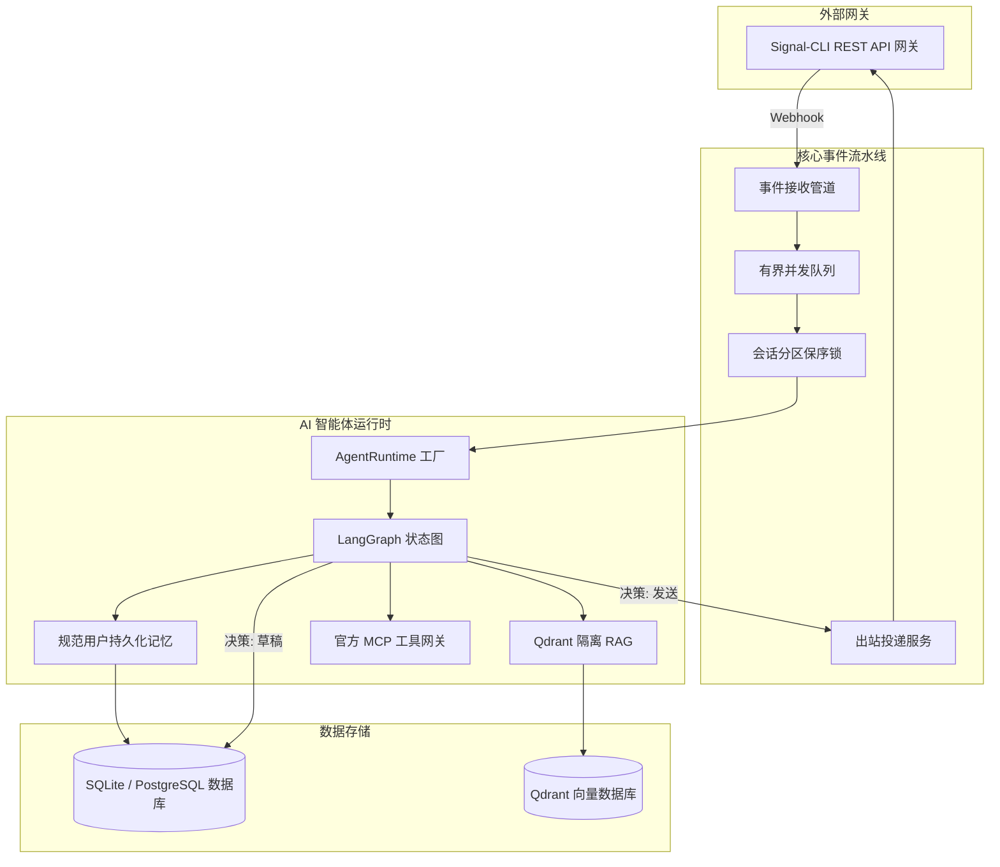

<div align="center">

# 🤖 Signal Market Bot

### 面向 Signal 生态的智能客服与对话式电商自动化中台

[](https://github.com/yuanweize/signal-market-bot/releases)
[](https://github.com/yuanweize/signal-market-bot/actions)
[](https://github.com/yuanweize/signal-market-bot/pkgs/container/signal-market-bot-backend)
[](backend/pyproject.toml)
[](frontend/package.json)
[](LICENSE)

[English](README.md) • [简体中文](README.zh-CN.md) • [系统架构文档](docs/ARCHITECTURE.md) • [更新日志](CHANGELOG.md)

</div>

---

<div align="center">
  
  <p><em>Signal Market Bot 运营全景看板 — 实时业务指标、消息流量统计、群发活动追踪与商品目录分析</em></p>
</div>

<div align="center">
  
  <p><em>运行时 AI 引擎中台 — 多大模型提供商通用适配、温度采样调节、动态 Prompt 上下文注入与全热重载</em></p>
</div>

---

## 🌟 项目概述

**Signal Market Bot** 是一套专为 Signal 通信生态打造的智能客户支持与对话电商自动化中台。系统将端到端加密的 Signal 即时通讯与现代大语言模型（LLM）智能体、实时人工客服接管、商品目录库及合规社群自动化群发能力深度结合。

在 **v0.4 AI 平台升级** 中，系统引入了基于 **LangGraph** 的生产级智能体运行时，具备 **Copilot 人机协同（带消息溯源）**、**渐进式技能加载**、**基于 Qdrant 的多范围隔离 RAG 检索**、**规范身份持久化记忆**、**官方 MCP SDK 工具治理** 以及 **Human-in-the-Loop 持续学习闭环**。

---

## 🚀 核心特性

### 🤖 AI 智能体平台 (v0.4)
- **LangGraph 状态图工作流**：基于有向状态图执行渐进式技能匹配、多范围 RAG 检索、工具鉴权、事实依据生成与决策分类（`reply`、`draft_for_human`、`handoff`、`no_reply`）。
- **生产运行时工厂（杜绝假实现）**：生产环境下严格禁止静默回退到 Fake 模拟器，必须连接真实的 OpenAI 兼容大模型/向量嵌入接口以及 Qdrant 向量数据库，否则明确抛出异常并降级。
- **严格群组隐私隔离（P0 不变量）**：群聊上下文严格禁止检索或向 Prompt 注入任何用户的私聊笔记或个人记忆，杜绝群聊越权泄露私密数据。
- **客服收件箱 Copilot 协同**：为人工坐席提供实时回复草稿，支持一键“采纳发送”、“在编辑器中修改”、“放弃草稿”，并通过“证据抽屉”查看引用的知识源切片、记忆条目与工具调用。
- **消息溯源全链路追踪**：严格标记消息来源（`customer`、`ai_auto`、`human_ai_assisted`、`human_manual`、`system`、`campaign`）并关联底层的 `ai_run_id` 执行追踪。
- **多范围隔离 RAG 知识库**：采用 Qdrant 向量数据库，支持确定性 UUID 映射、稠密向量检索以及从关系型数据库全量重建向量索引（`POST /api/ai-studio/knowledge/reindex`）。
- **规范身份持久化记忆**：提取并沉淀客户长期偏好与事实，严格绑定规范用户身份（手机号与 Signal UUID 归一到同一命名空间），支持单条安全删除。
- **受控工具与官方 MCP SDK 集成**：使用官方 Python `mcp` SDK 实现 stdio 客户端会话与工具动态发现；敏感/写操作（如退款）强制触发主管审核草稿（`draft_for_human`），禁止模型擅自执行。
- **持续学习闭环**：捕获人工坐席对 AI 草稿的修改，自动聚合并推荐高质量知识候选，支持一键沉淀为标准 FAQ 或导出微调 JSONL 数据集。
- **确定性契约评测套件**：内置 32 项确定性契约测试案例（`python evals/run_evals.py`），覆盖 Prompt 注入防御、人工转接、退款审批、跨语言支持与隐私隔离边界，CI 准确率保持 100%。

### 📥 现代客服收件箱与接管
- **双栏客服控制台**：全量会话可视化视图，支持未读计数徽标、全局会话检索与多维筛选（单聊 / 群聊 / 未读）。
- **4 态无竞态接管引擎**：支持在 **Auto（AI自动回复）**、**Copilot（人机协同草稿）**、**Manual（纯人工接管）** 与 **Paused（会话静音）** 之间即时切换；在消息出站前进行严格并发校验，人工介入时自动废弃 AI 消息。
- **投递状态机全链路追踪**：每条出站消息具备完整状态流转（`received` / `pending` -> `sent` / `failed` -> `delivered` -> `read`），网络抖动失败时提供一键重发。
- **富媒体与表情互动**：完整解析并持久化 Signal 附件与 Emoji Reaction 事件并在会话时间线中渲染。

### ⚡ 弹性消息摄取与分发流水线
- **背压控制有界队列**：内存事件管道采用固定容量缓冲队列（`maxsize=1000`），防止瞬时流量激增导致内存溢出。
- **并发多工作池与分区保序**：异步工作池采用会话级并发锁（Conversation Partition Locking），确保不同会话并发隔离的同时，严格保持单会话消息时序。
- **双重可靠去重**：LRU 高速内存去重过滤配合数据库唯一约束，无惧网关重连与重复推送。

### 📢 精准社群广播与风控
- **批量群发投放**：一键面向多个目标 Signal 群组推送营销活动与通知公告。
- **合规风控策略**：内置静音时段保护、群组黑名单屏蔽与零风险安全演练（Dry-Run）预览模式。

### 🔒 运营安全与免 .env 配置
- **首次部署安全初始化**：首次启动提供向导式管理员配置，采用 scrypt 算法密码哈希与可选 TOTP 双因子动态口令（2FA）。
- **加密运行时配置**：所有外部网关凭证、大模型密钥及敏感配置均通过前端管理后台维护，存储于加密数据库中，配置即时热重载。
- **审计追踪体系**：关键管理操作、权限变更与接管记录均全量持久化为安全审计日志。

---

## 📚 技术文档

- 🏛️ [系统架构与数据流转](docs/ARCHITECTURE.md)
- 🤖 [AI 平台子系统与运行时工厂](docs/AI_PLATFORM.md)
- 🔒 [安全规范与隐私隔离不变量](docs/SECURITY_PRIVACY.md)
- 🧪 [自动化测试矩阵与验证报告](docs/TESTING.md)
- 🗺️ [产品演进路线图](docs/ROADMAP.md)
- 🔄 [数据库迁移指南 (Alembic)](docs/MIGRATION.md)
- 🔌 [Signal 网关 API 契约与 Webhooks](docs/SIGNAL_API_CONTRACT.md)
- 📱 [Signal 真实环境验证指南](docs/REAL_SIGNAL_VALIDATION.md)
- 🔍 [v0.4 真实性审计报告](docs/releases/v0.4.0-audit.md)

---

## 🏗️ 架构拓扑



---

## 🛠️ 本地开发指南

### 后端开发

```bash
cd backend

# 创建并激活 Python 虚拟环境
python3 -m venv .venv
source .venv/bin/activate

# 可编辑模式安装依赖
pip install -e ".[dev]"

# 运行单元/集成测试与代码检查
pytest tests/ -v
ruff check app tests evals
ruff format --check app tests evals

# 运行 32 项确定性智能体契约评测套件
python evals/run_evals.py

# 启动开发服务器
uvicorn app.main:app --reload --port 8000
```

### 前端开发

```bash
cd frontend

# 安装 Node 依赖
npm ci

# 运行组件测试与代码检查
npm test
npm run lint
npx tsc --noEmit
npm run build

# 启动 Vite 本地开发热重载服务器
npm run dev
```

---

## 📊 技术规格

| 分层 | 关键技术选型 |
|---|---|
| **后端框架** | [FastAPI](https://fastapi.tiangolo.com/) 0.115+ (异步 Python 3.12) |
| **智能体编排** | [LangGraph](https://github.com/langchain-ai/langgraph) + StateGraph + 渐进式技能系统 |
| **向量数据库** | [Qdrant](https://qdrant.tech/) 官方 `qdrant-client` 1.10+ (`query_points`) |
| **工具协议** | 官方 [Model Context Protocol (MCP)](https://modelcontextprotocol.io/) Python SDK 2.x |
| **ORM 与数据持久化** | [SQLAlchemy](https://www.sqlalchemy.org/) 2.0 (AsyncIO) + [aiosqlite](https://github.com/omnilib/aiosqlite) (SQLite 正式生产验证，PostgreSQL 路线图中) + [Alembic](https://alembic.sqlalchemy.org/) 线性迁移 |
| **前端技术栈** | [React](https://react.dev/) 18 + [Vite](https://vitejs.dev/) + [TypeScript](https://www.typescriptlang.org/) + [React Router](https://reactrouter.com/) 7.18+ |
| **UI 样式体系** | [Tailwind CSS](https://tailwindcss.com/) + [DaisyUI](https://daisyui.com/) |
| **安全与认证** | Scrypt KDF 密码哈希 + Fernet 数据库密钥加密 + [PyOTP](https://github.com/pyauth/pyotp) (TOTP 2FA) + [python-jose](https://github.com/mpdavis/python-jose) (JWT) |
| **测试与质量网关** | [pytest](https://docs.pytest.org/) (109 项后端测试) + [Vitest](https://vitest.dev/) (18 项前端测试) + 32 项确定性契约测试 |
| **容器化交付** | Docker 多阶段构建 + Docker Compose + GitHub Container Registry (GHCR) |

---

## 📄 开源许可证

本项目基于 [MIT License](LICENSE) 协议开源。
