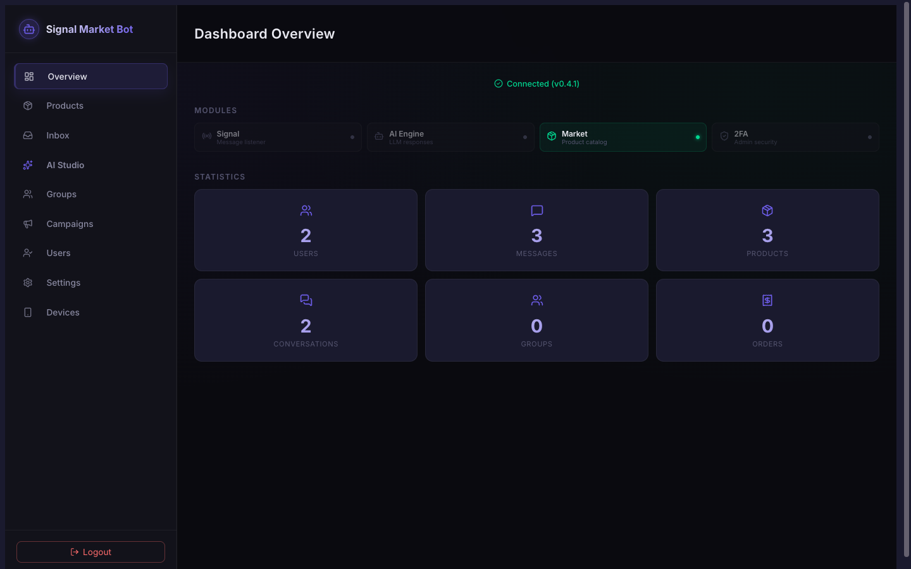
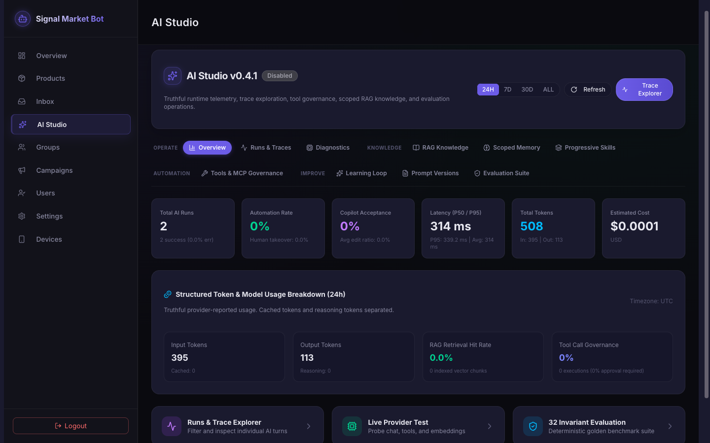
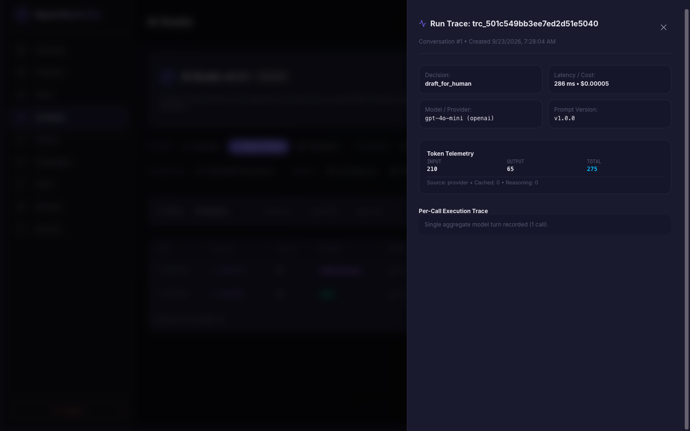
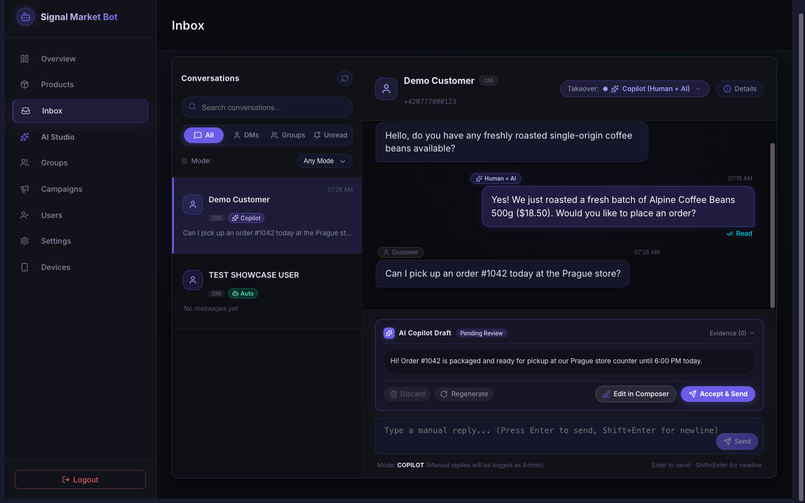
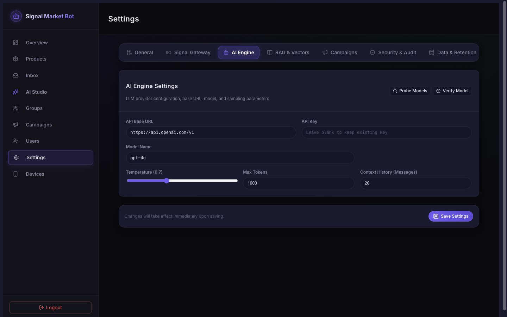
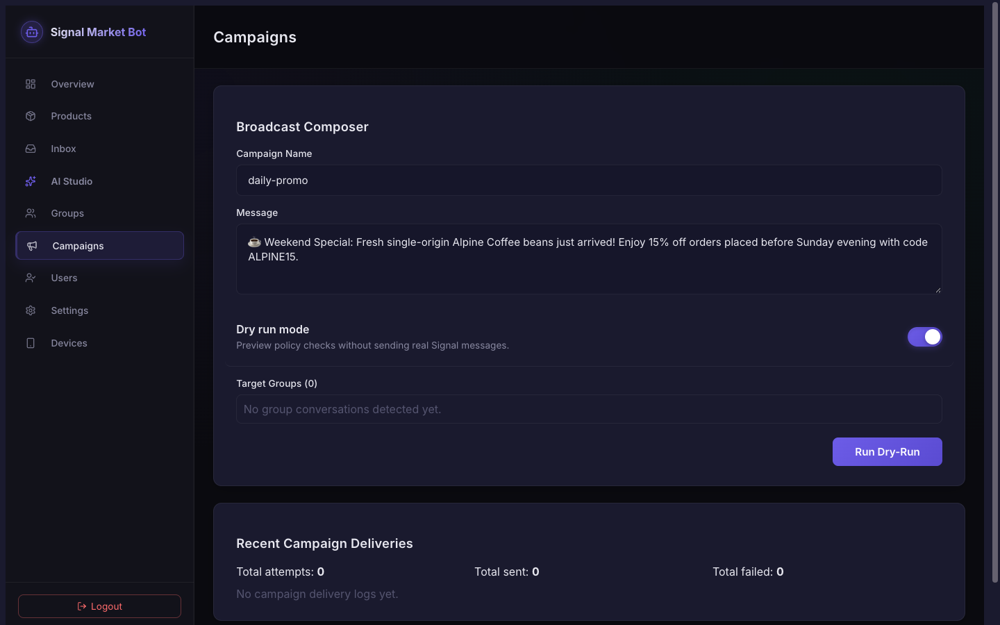
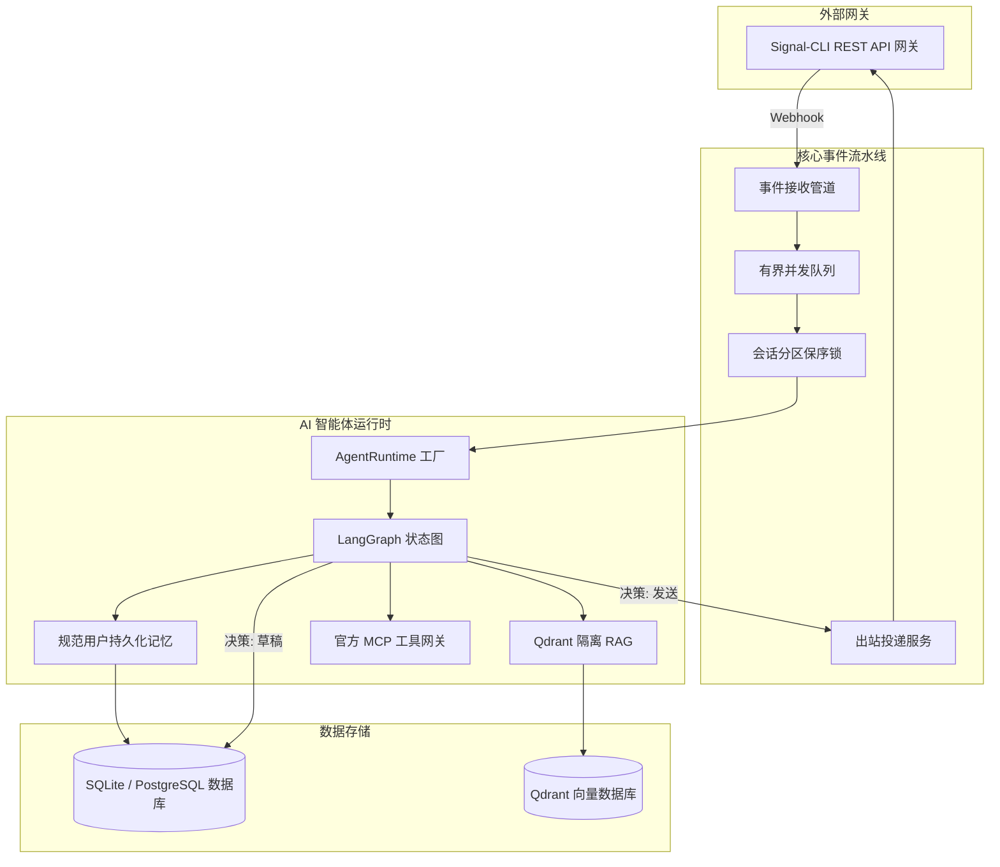

<div align="center">

# 🤖 Signal AI Agent Platform

### 面向 Signal 生态的实时多模态智能客服与对话式电商 AI 智能体平台

<p align="center">
  面向生产环境的 AI 智能体平台，深度集成 <strong>Signal 即时通讯</strong> 与 <strong>实时 SSE 事件流</strong>、<strong>流式 Copilot 草稿生成</strong>、<strong>多模态附件理解（视觉与语音）</strong>、<strong>LangGraph 有状态智能体</strong>、<strong>细粒度作用域 RAG 检索</strong> (Qdrant)、<strong>可扩展 MCP 工具协议</strong> 以及 <strong>全链路运行时可观测性</strong>。
</p>

[](https://github.com/yuanweize/signal-ai-agent-platform/releases)
[](https://github.com/yuanweize/signal-ai-agent-platform/actions)
[](https://github.com/yuanweize/signal-ai-agent-platform/pkgs/container/signal-ai-agent-platform-backend)
[](backend/pyproject.toml)
[](frontend/package.json)
[](LICENSE)

[English](README.md) • [简体中文](README.zh-CN.md) • [系统架构文档](docs/ARCHITECTURE.md) • [更新日志](CHANGELOG.md)

</div>

---

<div align="center">
  
  <p><em>Signal AI Agent Platform 运营全景看板 — 实时业务指标、消息流量统计、核心模块健康度与商品目录分析</em></p>
</div>

<div align="center">
  
  <p><em>AI Studio 可观测性与运营控制台 — 真实运行时 Token 消耗分解、分位耗时统计、结构化用量看板与四大业务分组中台</em></p>
</div>

### 📸 产品导览 (Product Tour)

<table>
  <tr>
    <td width="50%" align="center">
      
      <br><strong>Runs & Trace 链路执行分析器</strong><br><em>抽屉式链路追踪面板，呈现单次 Turn 模型调用明细、决策归因与 Token 分解</em>
    </td>
    <td width="50%" align="center">
      
      <br><strong>客服工作台 Copilot 协同与接管</strong><br><em>人机协同流式草稿生成、多模态附件展开与 4 态接管模式无缝切换</em>
    </td>
  </tr>
  <tr>
    <td width="50%" align="center">
      
      <br><strong>运行时 AI 引擎参数配置</strong><br><em>通用 OpenAI 兼容接口配置、在线模型探测探针与加密凭据存储</em>
    </td>
    <td width="50%" align="center">
      
      <br><strong>群发活动与社群营销广播</strong><br><em>目标群组广播编辑器、静默期与防打扰策略、演练试跑验证与投递日志</em>
    </td>
  </tr>
</table>

---

## 🌟 项目概述

**Signal AI Agent Platform** 是一套专为 Signal 通信生态打造的智能客户支持与对话电商自动化中台。系统将端到端加密的 Signal 即时通讯与现代大语言模型（LLM）智能体、实时人工客服接管、商品目录库及合规社群自动化群发能力深度结合。

在 **v0.5 实时与多模态智能里程碑** 中，系统带来：
1. **实时 SSE 事件架构**：客服收件箱、Copilot 草稿与 AI 运行事件毫秒级推送，具备背压防护与断线重连缓冲。
2. **流式 Copilot 草稿生成**：坐席端打字机渐进式生成体验，支持实时取消并完整记录 Token 遥测；流式片段严格隔离在 Web 终端，严禁向外部 Signal 用户发送未完成片段。
3. **多模态 Signal 消息流水线**：安全解析客户发送的图片（商品、发票、凭证）与语音留言，严格限制 MIME 与文件大小，杜绝 SSRF 风险，将多模态提取文本作为不可信用户输入进行安全处理。
4. **LangGraph 状态图智能体架构**：结合渐进式技能、隔离 RAG、规范记忆与 MCP 工具治理。

---

## 🚀 核心特性

### ⚡ 实时事件与多模态智能 (v0.5)
- **实时 SSE 事件总线**：生产级 `RealtimeEventBroker`，提供单客户端背压队列限制（最大 100 队列）、基于 `Last-Event-ID` 的重播缓冲、指数退避重连机制与隐私脱敏过滤广播。
- **流式 Copilot 智能草稿**：操作员可一键启动流式草稿生成，逐 token 实时打字机渲染，支持客户端中途 Cancel 取消。中间 token 绝不发往 Signal 网络，彻底杜绝半截消息泄露。
- **多模态视觉理解**：支持商品图片、发票凭据与截图的高级视觉解析，自动提取结构化文本上下文，严格作为不可信用户输入插入提示词上下文，防止越权注入。
- **语音留言智能转录**：支持将 Signal 语音笔记通过兼容 Whisper/音频转录接口转为文字，采用安全隔离的临时文件（0600 权限，处理后立即销毁），操作员可直接查看转录详情。
- **真实能力诊断矩阵**：在 AI Studio 中直观呈现文本 LLM、流式生成、视觉识别、音频转录、Qdrant 向量库、MCP 协议及 Signal 网关的真实连接与能力状态。

### 🤖 智能体平台与治理
- **LangGraph 状态图工作流**：基于有向状态图执行渐进式技能匹配、多范围 RAG 检索、工具鉴权、事实依据生成与决策分类（`reply`、`draft_for_human`、`handoff`、`no_reply`）。
- **生产运行时工厂（杜绝假实现）**：生产环境下严格禁止静默回退到 Fake 模拟器，必须连接真实的 OpenAI 兼容大模型/向量嵌入接口以及 Qdrant 向量数据库，否则明确抛出异常并降级。
- **严格群组隐私隔离（P0 不变量）**：群聊上下文严格禁止检索或向 Prompt 注入任何用户的私聊笔记或个人记忆，杜绝群聊越权泄露私密数据。
- **消息溯源全链路追踪**：严格标记消息来源（`customer`、`ai_auto`、`human_ai_assisted`、`human_manual`、`system`、`campaign`）并关联底层的 `ai_run_id` 执行追踪。
- **多范围隔离 RAG 知识库**：采用 Qdrant 向量数据库，支持确定性 UUID 映射、稠密向量检索以及从关系型数据库全量重建向量索引（`POST /api/ai-studio/knowledge/reindex`）。
- **规范身份持久化记忆**：提取并沉淀客户长期偏好与事实，严格绑定规范用户身份（手机号与 Signal UUID 归一到同一命名空间），支持单条安全删除。
- **受控工具与官方 MCP SDK 集成**：使用官方 Python `mcp` SDK 实现 stdio 客户端会话与工具动态发现；敏感/写操作（如退款）强制触发主管审核草稿（`draft_for_human`），禁止模型擅自执行。
- **持续学习闭环**：捕获人工坐席对 AI 草稿的修改，自动聚合并推荐高质量知识候选，支持一键沉淀为标准 FAQ 或导出微调 JSONL 数据集。
- **确定性契约评测套件**：内置 32 项确定性契约测试案例（`python evals/run_evals.py`），100% 通过率持续守卫模型行为边界。

### 🎛️ AI Studio 可观测性与运营控制台
- **真实运行时度量**：看板指标、组件就绪徽章与 Token 消耗严格来源于真实运行时健康诊断与执行记录，拒绝虚假假装。
- **中立多维度 Token 遥测**：完整追踪与展示 Prompt 输入、输出、缓存复用与推理思考 Token 细分，配合中立定价矩阵真实核算成本。
- **层级化信息架构 (IA)**：构建 4 大功能模块响应式布局：**Operate 运营**、**Knowledge 知识**、**Automation 自动化**、**Improve 调优**。
- **执行轨迹与单次模型调用深度排查**：完整执行日志下钻，支持决策/错误/RAG/工具多维筛选与分页，滑动抽屉呈现包含每次底层模型调用（`ai_model_calls`）的精确遥测与引用事实。
- **实时模型连接探针与一键连通性测试**：一键发起真实探测，核验大模型往返耗时、流式能力、视觉支持、转录支持、Embedding 连通性与回复预览。
- **评测套件持久化运行**：支持 32 项确定性契约测试与真实大模型黄金案例抽样评测，评测历史全量落库可供比对。

### 📥 现代客服收件箱与接管
- **实时响应式收件箱**：基于 SSE 事件的实时消息刷新、未读徽标与会话更新，保留断线轮询降级机制。
- **4 态无竞态接管引擎**：支持在 **Auto（AI自动回复）**、**Copilot（人机协同草稿）**、**Manual（纯人工接管）** 与 **Paused（会话静音）** 之间即时切换。
- **投递状态机全链路追踪**：每条出站消息具备完整状态流转（`received` / `pending` -> `sent` / `failed` -> `delivered` -> `read`），网络抖动失败时提供一键重发。
- **多模态附件展示与表情互动**：完整解析并渲染 Signal 多模态附件（支持展开视觉说明与语音听写全文）及 Emoji Reaction。

### ⚡ 弹性消息摄取与分发流水线
- **背压控制有界队列**：内存事件管道采用固定容量缓冲队列（`maxsize=1000`），防止瞬时流量激增导致内存溢出。
- **并发多工作池与分区保序**：异步工作池采用会话级并发锁（Conversation Partition Locking），确保不同会话并发隔离的同时，严格保持单会话消息时序。
- **双重可靠去重**：LRU 高速内存去重过滤配合数据库唯一约束，无惧网关重连与重复推送。

### 📢 精准社群广播与风控
- **批量群发投放**：一键面向多个目标 Signal 群组推送营销活动与通知公告。
- **合规风控策略**：内置静音时段保护、群组黑名单屏蔽与零风险安全演练（Dry-Run）预览模式。

### 🔒 运营安全与免 .env 配置
- **首次部署安全初始化**：首次启动提供向导式管理员配置，采用 scrypt 算法密码哈希与可选 TOTP 双因子动态口令（2FA）。
- **加密运行时配置**：所有外部网关凭证、大模型密钥及敏感配置均通过前端管理后台维护，存储于加密数据库中，配置即时热重载。
- **审计追踪体系**：关键管理操作、权限变更与接管记录均全量持久化为安全审计日志。

---

## 📚 技术文档

- 🏛️ [系统架构与数据流转](docs/ARCHITECTURE.md)
- 🤖 [AI 平台子系统与运行时工厂](docs/AI_PLATFORM.md)
- 🔒 [安全规范与隐私隔离不变量](docs/SECURITY_PRIVACY.md)
- 🧪 [自动化测试矩阵与验证报告](docs/TESTING.md)
- 🗺️ [产品演进路线图](docs/ROADMAP.md)
- 🔄 [数据库迁移指南 (Alembic)](docs/MIGRATION.md)
- 🔌 [Signal 网关 API 契约与 Webhooks](docs/SIGNAL_API_CONTRACT.md)
- 📱 [Signal 真实环境验证指南](docs/REAL_SIGNAL_VALIDATION.md)
- 🔍 [v0.4 真实性审计报告](docs/releases/v0.4.0-audit.md)

---

## 🏗️ 架构拓扑



---

## 🛠️ 本地开发指南

### 后端开发

```bash
cd backend

# 创建并激活 Python 虚拟环境
python3 -m venv .venv
source .venv/bin/activate

# 可编辑模式安装依赖
pip install -e ".[dev]"

# 运行单元/集成测试与代码检查
pytest tests/ -v
ruff check app tests evals
ruff format --check app tests evals

# 运行 32 项确定性智能体契约评测套件
python evals/run_evals.py

# 启动开发服务器
uvicorn app.main:app --reload --port 8000
```

### 前端开发

```bash
cd frontend

# 安装 Node 依赖
npm ci

# 运行组件测试与代码检查
npm test
npm run lint
npx tsc --noEmit
npm run build

# 启动 Vite 本地开发热重载服务器
npm run dev
```

---

## 📊 技术规格

| 分层 | 关键技术选型 |
|---|---|
| **后端框架** | [FastAPI](https://fastapi.tiangolo.com/) 0.115+ (异步 Python 3.12) |
| **智能体编排** | [LangGraph](https://github.com/langchain-ai/langgraph) + StateGraph + 渐进式技能系统 |
| **向量数据库** | [Qdrant](https://qdrant.tech/) 官方 `qdrant-client` 1.10+ (`query_points`) |
| **工具协议** | 官方 [Model Context Protocol (MCP)](https://modelcontextprotocol.io/) Python SDK 2.x |
| **ORM 与数据持久化** | [SQLAlchemy](https://www.sqlalchemy.org/) 2.0 (AsyncIO) + [aiosqlite](https://github.com/omnilib/aiosqlite) (SQLite 正式生产验证，PostgreSQL 路线图中) + [Alembic](https://alembic.sqlalchemy.org/) 线性迁移 |
| **前端技术栈** | [React](https://react.dev/) 18 + [Vite](https://vitejs.dev/) + [TypeScript](https://www.typescriptlang.org/) + [React Router](https://reactrouter.com/) 7.18+ |
| **UI 样式体系** | [Tailwind CSS](https://tailwindcss.com/) + [DaisyUI](https://daisyui.com/) |
| **安全与认证** | Scrypt KDF 密码哈希 + Fernet 数据库密钥加密 + [PyOTP](https://github.com/pyauth/pyotp) (TOTP 2FA) + [python-jose](https://github.com/mpdavis/python-jose) (JWT) |
| **测试与质量网关** | [pytest](https://docs.pytest.org/) (157 项后端测试) + [Vitest](https://vitest.dev/) (23 项前端测试 / 7 组文件) + 32 项确定性契约评测 (100% 通过) + 6 阶段迁移生命周期测试 + Docker 容器运行时冒烟 ([详见文档](docs/TESTING.md)) |
| **容器化交付** | Docker 多阶段构建 + Docker Compose + GitHub Container Registry (GHCR) |

---

## 📄 开源许可证

本项目基于 [MIT License](LICENSE) 协议开源。
