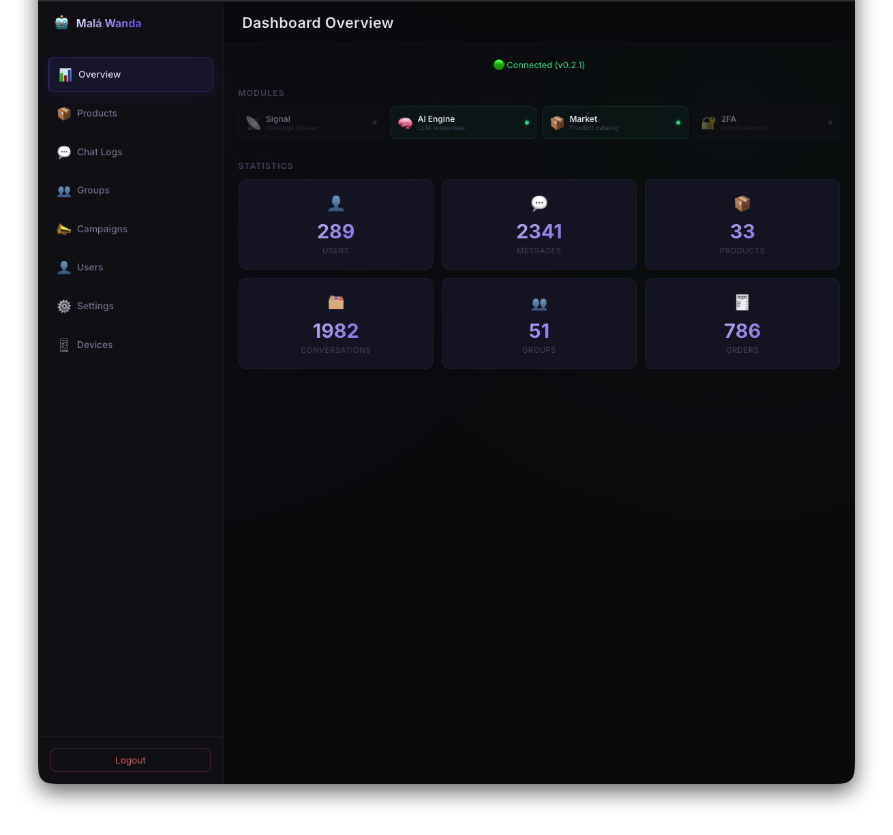
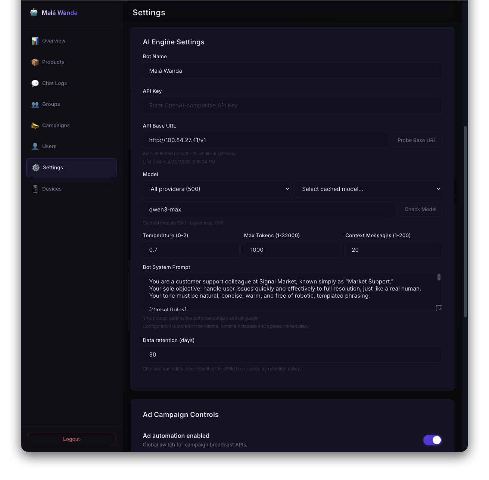
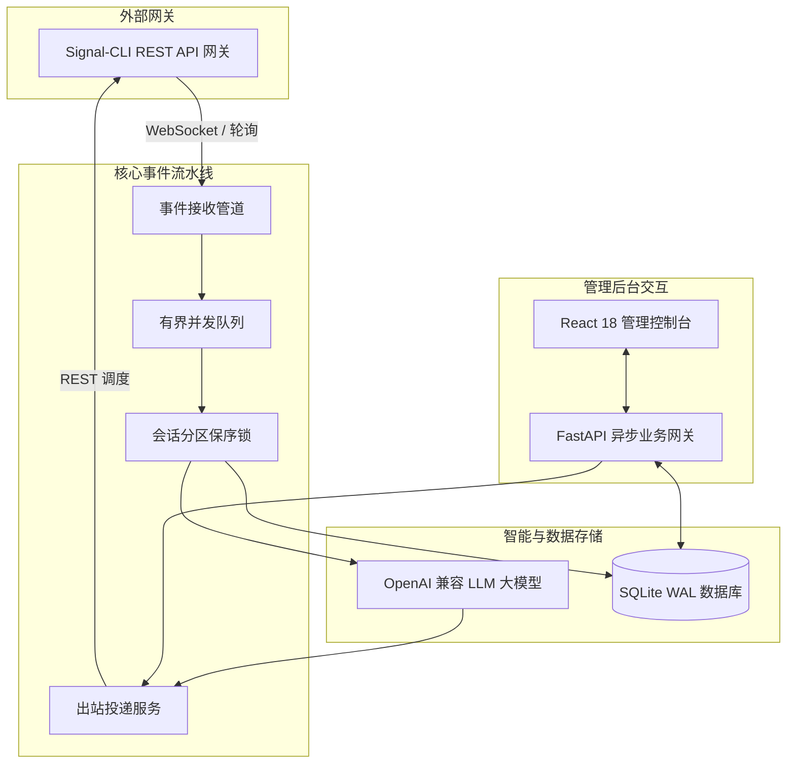

<div align="center">

# 🤖 Signal Market Bot

### 面向 Signal 生态的生产级智能客服与对话式电商中台

[](https://github.com/yuanweize/signal-market-bot/releases)
[](https://github.com/yuanweize/signal-market-bot/actions)
[](https://github.com/yuanweize/signal-market-bot/pkgs/container/signal-market-bot-backend)
[](backend/pyproject.toml)
[](frontend/package.json)
[](LICENSE)

[English](README.md) • [简体中文](README.zh-CN.md) • [系统架构文档](docs/ARCHITECTURE_CURRENT.md) • [更新日志](CHANGELOG.md)

</div>

---

<div align="center">
  
  <p><em>Signal Market Bot 运营全景看板 — 实时业务指标、消息流量统计、群发活动追踪与商品目录分析</em></p>
</div>

<div align="center">
  
  <p><em>运行时 AI 引擎中台 — 多大模型提供商通用适配、温度采样调节、动态 Prompt 上下文注入与全热重载</em></p>
</div>

---

## 🌟 项目概述

**Signal Market Bot** 是一套专为 Signal 通信场景打造的高性能、企业级对话电商与智能客户支持中台。系统将端到端 Signal 安全即时通讯与现代大语言模型（LLM）、实时人工客服接管、商品目录库及合规社群自动化群发能力深度结合。

系统基于高并发异步 **FastAPI** 后端与现代化 **React + Tailwind + DaisyUI** 前端控制台构建，彻底废弃了繁琐且易出错的 `.env` 环境变量配置方式，提供完全基于数据库持久化与金融级加密的后台运行时配置界面，开箱即用。

---

## 🚀 核心特性

### 🧠 全能插拔式 AI 大模型中台
- **通用协议兼容**：无缝对接 OpenAI、DeepSeek、Ollama、vLLM、LocalAI、Azure OpenAI 及任何兼容 OpenAI 协议的自建模型网关。
- **动态上下文注入**：自动将最新商品库存、上下文历史会话以及业务提示词精准注入 Prompt。
- **群聊环境智能感知**：群聊场景下精准标记发言人身份与昵称，智能过滤重复消息，提供自然拟人化的回复交互。

### 📥 现代客服收件箱与竞态消除接管
- **双栏直观客服控制台**：全量会话可视化视图，支持未读计数徽标、全局会话检索与多维筛选（单聊 / 群聊 / 未读）。
- **并发安全的人工接管**：支持在 **Auto（AI自动回复）**、**Manual（人工接管）** 与 **Paused（会话静音）** 之间即时热切换；内置消息出站前会话状态二次校验机制，若客服在模型生成期间介入，AI 消息将自动安全废弃，防止机器人与人工争抢回复。
- **投递状态机全链路追踪**：每条出站消息具备完整状态流转（`received` / `pending` -> `sent` / `failed` -> `delivered` -> `read`），网络抖动失败时提供一键重新发送机制。
- **富媒体与表情互动**：完整解析并持久化 Signal 附件与 Emoji Reaction 事件并在时间线中渲染。

### ⚡ 弹性消息摄取与分发流水线
- **背压控制有界队列**：内存事件管道采用固定容量缓冲队列（`maxsize=1000`），无惧瞬时高并发流量冲击。
- **并发多协程工作池**：异步多线程/协程消费，采用会话级别（Conversation Partition）并发锁，在保证不同聊天相互隔离的同时，绝对确保同一会话消息的严格时序。
- **双重可靠去重**：LRU 高速内存去重过滤配合数据库唯一约束，无惧网关重连与重复推送。

### 👥 用户身份归一与群组成员同步
- **用户身份统一解析**：将用户手机号（E.164）与 Signal UUID 映射到唯一的物理用户实体，确保跨场景资产与记录归一。
- **群组成员与权限花名册**：自动抓取并维护群成员列表、管理员权限与入群退群动态。

### 📢 精准社群广播与安全风控
- **批量群发投放**：一键面向多个目标 Signal 群组推送营销活动与通知公告。
- **合规风控策略**：内置静音时段保护、群组黑名单屏蔽与免发真实消息的安全演练（Dry-Run）预览模式。

### 🔒 银行级安全与免 .env 运营
- **首次部署安全初始化**：首次启动提供向导式管理员配置，采用高强度 scrypt 算法密码哈希与可选 TOTP 双因子动态口令（2FA）。
- **加密运行时配置**：所有外部网关凭证、大模型密钥及敏感配置均通过前端管理后台维护，存储于加密数据库中，配置即时热重载。
- **审计追踪体系**：关键管理操作、权限变更与接管记录均全量持久化为安全审计日志。

---

## 🏗️ 架构拓扑



---

## 🏁 快速上手

### 环境准备
- [Docker](https://docs.docker.com/get-docker/) 与 [Docker Compose](https://docs.docker.com/compose/)
- 一个可用的 Signal 账号以及运行中的 [signal-cli-rest-api](https://github.com/bbernhard/signal-cli-rest-api)

### 1. 使用 Docker Compose 一键启动

```bash
git clone https://github.com/yuanweize/signal-market-bot.git
cd signal-market-bot

# 拉取官方最新预构建镜像并启动
docker compose pull
docker compose up -d

# 执行数据库初始版本迁移
docker compose exec backend alembic upgrade head
```

### 2. 访问服务控制台

| 服务入口 | 地址 | 说明 |
|---|---|---|
| **管理后台** | [http://localhost:3000](http://localhost:3000) | 现代化 Web 运维与客服操作端 |
| **核心 API 服务** | [http://localhost:8000](http://localhost:8000) | 异步主网关端口 |
| **交互式 API 文档** | [http://localhost:8000/docs](http://localhost:8000/docs) | OpenAPI Swagger 接口测试平台 |
| **存活健康探针** | [http://localhost:8000/health/live](http://localhost:8000/health/live) | 容器生命周期健康检查 |
| **就绪就绪探针** | [http://localhost:8000/health/ready](http://localhost:8000/health/ready) | 数据库连接与迁移状态就绪检查 |

### 3. 首次部署安全向导

1. 浏览器打开 [http://localhost:3000/login](http://localhost:3000/login)。
2. 系统自动识别首次运行状态，引导设置初始管理员用户名及高强度密码。
3. 可选绑定 TOTP 双因子动态令牌（如 Google Authenticator、1Password）。
4. 登录后进入 **Settings** 页面，配置您的 Signal Gateway 链接与 AI 引擎参数即可投入运营。

---

## 🛠️ 本地开发环境

### 后端开发

```bash
cd backend

# 创建并激活 Python 虚拟环境
python3 -m venv .venv
source .venv/bin/activate

# 安装开发依赖
pip install -e ".[dev]"

# 运行后端自动化单元测试与代码检查
pytest tests/ -v
ruff check app tests
ruff format --check app tests

# 启动本地热重载调试服务
uvicorn app.main:app --reload --port 8000
```

### 前端开发

```bash
cd frontend

# 安装依赖
npm install

# 运行前端组件单元测试与语法检查
npm test
npm run lint
npx tsc --noEmit

# 启动开发服务器
npm run dev
```

---

## 📊 技术栈与架构指标

| 分层 | 技术选型 |
|---|---|
| **后端框架** | [FastAPI](https://fastapi.tiangolo.com/) 0.115+ (Python 3.11+ 异步并发架构) |
| **数据库与持久层** | [SQLAlchemy](https://www.sqlalchemy.org/) 2.0 (AsyncIO) + [aiosqlite](https://github.com/omnilib/aiosqlite) + [Alembic](https://alembic.sqlalchemy.org/) 科学迁移系统 |
| **前端技术栈** | [React](https://react.dev/) 18 + [Vite](https://vitejs.dev/) + [TypeScript](https://www.typescriptlang.org/) |
| **样式与组件库** | [Tailwind CSS](https://tailwindcss.com/) + [DaisyUI](https://daisyui.com/) (无缝自适应桌面与移动端) |
| **身份安全机制** | Scrypt 强密钥派生 + [PyOTP](https://github.com/pyauth/pyotp) (2FA 动态认证) + [python-jose](https://github.com/mpdavis/python-jose) (JWT 令牌) |
| **工程质量门禁** | [pytest](https://docs.pytest.org/) (54 项全量用例) + [Vitest](https://vitest.dev/) (14 项组件测试) + [Ruff](https://astral.sh/ruff) + [ESLint](https://eslint.org/) |
| **容器化与部署** | Docker Multi-stage 多阶段构建 + GitHub Container Registry 持续发布 |

---

## 📚 详细技术文档

如需了解完整的工程架构设计、领域模型细节及迁移指南，请参阅：

- 🏛️ [系统架构与数据流转拓扑](docs/ARCHITECTURE_CURRENT.md)
- 🔌 [Signal Gateway 接口契约与事件模型](docs/SIGNAL_API_CONTRACT.md)
- 🔄 [数据库 Schema 设计与平滑迁移手册](docs/MIGRATION.md)
- 🧪 [自动化测试矩阵与质量门禁规范](docs/TEST_MATRIX.md)
- 📱 [Signal 外部真实环境联调手册](docs/REAL_SIGNAL_VALIDATION.md)
- 🗺️ [演进目标架构路线图](docs/ARCHITECTURE_TARGET.md)

---

## 🗺️ 产品迭代路线

- [x] **v0.3.0**: 消息管道重构、多重身份归一、群组成员管理与现代化响应式客服收件箱。
- [ ] **v0.4.0**: 全双工 Server-Sent Events (SSE) / WebSocket 实时消息下发（替代轮询）。
- [ ] **v0.5.0**: 多模态媒体支持（音频语音消息直接转写、图片预览与本地缓存加速）。
- [ ] **v0.6.0**: 内置自动化订单结算全链路（集成 Stripe 与加密货币网关）。
- [ ] **v0.7.0**: 多客服协同冲突防碰撞与全局已读光标同步。

---

## 📄 开源许可证

本项目采用 [MIT License](LICENSE) 开源许可证。
