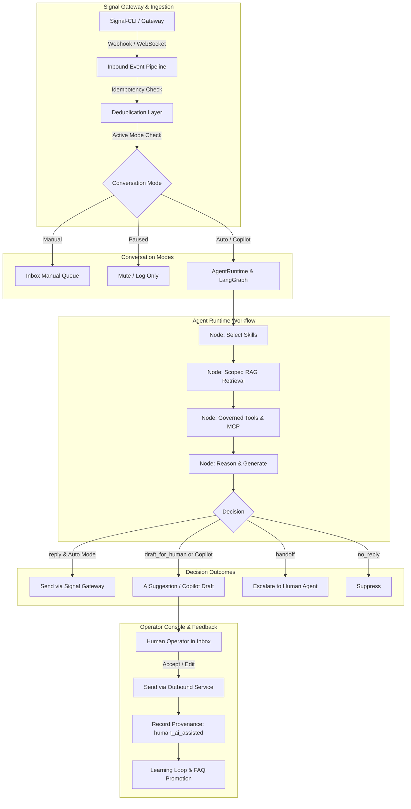

# Signal Market Bot — AI Platform v0.4 Architecture

## 1. Executive Summary

Signal Market Bot v0.4 elevates the system from a basic single-completion bot into an enterprise-grade **Signal-native AI Customer Service & Automation Platform**. The platform integrates a LangGraph-based state machine, multi-scope RAG knowledge base, progressive skill loading, durable scoped memory, governed MCP tools, copilot drafting, message provenance tracking, and a human-in-the-loop learning loop.

---

## 2. Core Architectural Pillars

### 2.1 LangGraph State Machine Workflow
The core execution engine (`app.ai.runtime.agent_runtime.AgentRuntime`) orchestrates incoming interactions via a deterministic, directed acyclic state graph:
- **`select_skills`**: Dynamically discovers relevant progressive skills based on intent and metadata, minimizing token consumption.
- **`retrieve_knowledge`**: Executes scope-isolated vector search across Global, Group, and User scopes.
- **`plan_tools`**: Evaluates business tools and MCP tools, enforcing permission boundaries and human approval checks for destructive operations.
- **`generate_response`**: Synthesizes the final prompt with untrusted data boundaries, produces an answer with citations, and assigns an `AgentDecision`.

### 2.2 Agent Decisions
The agent outputs structured decisions (`app.ai.runtime.decisions.AgentDecision`):
1. `reply`: Confidence is high and conversation mode allows automated response.
2. `draft_for_human`: Response requires human review (copilot mode, complaints, or sensitive tools).
3. `ask_clarifying`: Inquiry lacks mandatory information to proceed safely.
4. `handoff`: Customer requests human intervention or sentiment triggers escalation.
5. `no_reply`: System message or duplicate event suppressed from output.

### 2.3 Strict Message Provenance
Every message stored in the database captures its exact evolutionary origin:
- `customer`: Inbound message from Signal user.
- `ai_auto`: Fully autonomous AI generation in `auto` mode.
- `human_ai_assisted`: Copilot draft accepted or edited by human operator.
- `human_manual`: Message composed entirely by human agent.
- `system`: Automated platform notifications.
- `campaign`: Broadcast marketing messages.

Each message links to `ai_run_id`, `ai_suggestion_id`, and `admin_identity` for complete forensic audibility.

---

## 3. Observability & Tracing

The platform integrates `LocalTracer` recording every inference run into the `ai_runs` table:
- **Latencies**: End-to-end millisecond runtime breakdown.
- **Tokens**: Prompt, completion, and total tokens tracked per execution.
- **Decisions & Confidence**: Model confidence score and chosen routing branch.
- **Citations & Evidence**: Full snapshot of retrieved RAG chunks, memory items, and tool calls.
- **Explainability API**: `/api/conversations/messages/{id}/explain` provides instant debugging transparency for operators.
