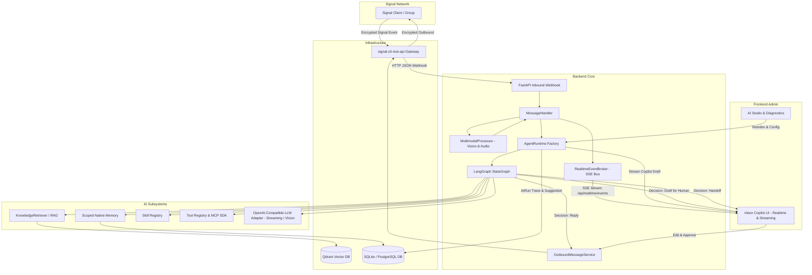

# System Architecture — Signal AI Agent Platform v0.5

## Overview

Signal AI Agent Platform is a **Signal-native AI customer support and conversational commerce platform** designed for secure, private, and high-reliability operations.

The system connects to Signal via an official `signal-cli-rest-api` gateway, ingests inbound JSON webhooks, normalizes them through an asynchronous message pipeline, and dispatches them through a unified LangGraph-based **AgentRuntime**. Outbound actions support autonomous replies, human-in-the-loop Copilot suggestions, or human handoff.

With **v0.5**, the platform introduces a high-throughput **Realtime SSE Event Layer**, interactive **Streaming Copilot Formulation**, and a secure **Multimodal Signal Message Pipeline** (vision analysis and voice note transcription).

---

## High-Level Architecture Diagram

---

## Core Components

### 1. Inbound Webhook & Deduplication Pipeline
- **Webhook Endpoint**: `POST /api/signal/webhook` receives incoming messages, attachments, receipts, and typing indicators.
- **Message Deduplication**: Deduplicated on `signal_event_id` and `(conversation_id, signal_timestamp_ms)`.
- **Identity Normalization**: Canonical user resolution binds telephone numbers and UUIDs into a single consistent user identity.

### 2. Unified Agent Runtime (`app/ai/runtime/`)
Both **Auto** and **Copilot** modes invoke the same production-grade `AgentRuntime`:
- **Factory Architecture (`app/ai/runtime/factory.py`)**: Builds live providers based on database-backed configuration. In production (`ENVIRONMENT=production`), silently falling back to `FakeLLMProvider` or `FakeVectorStore` is strictly forbidden.
- **StateGraph Orchestration (`app/ai/orchestration/graph.py`)**:
  1. `route_skills`: Deterministic rule router + progressive skill loading.
  2. `retrieve_knowledge`: RAG retrieval with scope-based filtering.
  3. `plan_tools`: Structured tool selection (e.g. catalog lookup, sensitive actions).
  4. `generate_response`: LLM completion with untrusted data boundary enforcement.
  5. `decide_action`: Emits `reply`, `draft_for_human`, `handoff`, or `no_reply`.
- **Manual Takeover Race Protection**: If an admin switches a conversation from `auto` to `manual` while the AI is executing, the outbound response is dropped before sending.

### 3. Retrieval-Augmented Generation (RAG) (`app/ai/rag/`)
- **Vector Store**: Qdrant (`QdrantVectorStore`), supporting persistent collections and in-memory test instances.
- **Scope Isolation**:
  - `global`: Accessible across all conversations.
  - `group`: Accessible only within the specific group context.
  - `user`: Accessible only in direct 1-on-1 conversations with that user. **Strict invariant**: Group chats never retrieve private user knowledge.
- **Reindexing Pipeline**: Rebuilds vector indexes on demand from relational documents (`POST /api/ai-studio/knowledge/reindex`).

### 4. Scoped Durable Memory (`app/ai/memory/`)
- Extracted preferences, communication language, and verified customer facts stored per canonical user namespace.
- **Group Isolation**: AgentRuntime disables loading private user memory when `context.is_group == True`.

### 5. Tools & MCP Integration (`app/ai/tools/`, `app/ai/mcp/`)
- Official `mcp` Python SDK 2.x stdio client with session initialization and discovery.
- **Permission Governance**: Tools require explicit administrative privilege (`read_only`, `requires_approval`, `write`). Destructive or financial tools (e.g. refunds) trigger supervisor drafts (`draft_for_human`).

### 6. Realtime SSE Event Layer (`app/realtime/`) (v0.5)
- **`RealtimeEventBroker`**: Application-level event broker supporting bounded per-subscriber FIFO queues (`maxsize=100`) to guarantee slow clients cannot trigger memory exhaustion.
- **Authenticated Endpoint**: `GET /api/realtime/events` requires standard HTTP Bearer token headers (preventing URL query parameter token leakage).
- **Reconnect & Resync**: Supports `Last-Event-ID` with an in-memory 150-event replay buffer. When overflow occurs or replay expires, clients are instructed to perform an authoritative REST sync.
- **Heartbeat & Cleanup**: Sends periodic comment keepalives (`: ping`) every 15s and detects disconnections instantly.

### 7. Streaming Copilot Generation (`app/ai/providers/llm.py`, `app/ai/runtime/`) (v0.5)
- **`stream_generate` Abstraction**: Provider interface yielding text deltas as an asynchronous generator.
- **Streaming Route**: `POST /api/conversations/{id}/suggestion/generate-stream` streams incremental tokens to the operator console.
- **Client Cancellation & Telemetry**: Operators can abort streaming anytime. Abort signals record `decision="cancelled"`, track latency until cancellation, and capture provider-reported token usage.
- **Strict Network Isolation**: Streaming tokens exist strictly in the operator UI. Partial token fragments are never dispatched to the external Signal network.

### 8. Multimodal Signal Message Pipeline (`app/services/multimodal.py`) (v0.5)
- **Visual Understanding**: Processes incoming image attachments (`image/jpeg`, `image/png`, `image/webp`, `image/gif`) using vision-enabled LLMs to extract descriptions and receipts.
- **Voice Note Transcription**: Speech-to-text pipeline transcribing incoming audio notes (`audio/ogg`, `audio/mp3`, `audio/wav`, `audio/aac`) using Whisper-compatible endpoints.
- **SSRF & Attachment Security**: Fetches attachment bytes strictly via internal Signal attachment IDs. Rejects remote arbitrary URLs.
- **Untrusted User Boundary**: Extracted image descriptions and audio transcripts are strictly treated as untrusted user inputs with prompt injection defenses.
- **Temporary Hygiene**: Temporary voice audio files are generated with mode `0600` in dedicated temporary directories and deleted in `finally` blocks.
