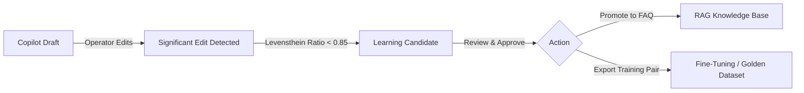

# Human-in-the-Loop Learning Loop

## 1. Architectural Overview

Production AI agents inevitably encounter edge cases or generate suboptimal drafts. Rather than letting human operator corrections vanish, Signal Market Bot turns every operator intervention into a flywheel for continuous improvement.

---

## 2. Edit Distance Detection & Candidate Extraction

When an operator clicks **"Edit in Composer"** and sends a modified message:
1. `app.services.outbound_service` tracks the origin suggestion (`ai_suggestion_id`).
2. `edit_distance_ratio` computes the similarity between the original suggestion and final sent text.
3. If the operator significantly modified the text (similarity $< 0.85$), `LearningCandidateService` records a new record in `learning_candidates`:
   - `input_context`: Customer's original inquiry.
   - `original_suggestion`: What the model drafted.
   - `final_response`: What the expert human sent.
   - `edit_ratio`: Computed distance score.

---

## 3. Knowledge Promotion & Dataset Export

In the **AI Studio > Learning Loop** tab, operators can:
1. **Promote to FAQ**: Automatically creates a new Knowledge Item in the RAG repository. On the next customer turn, the agent retrieves this verified human answer.
2. **Export Dataset**: `TrainingDatasetExporter` dumps curated pairs into OpenAI-compatible JSONL format (`system`, `user`, `assistant`) for model fine-tuning or inclusion in automated regression suites.
