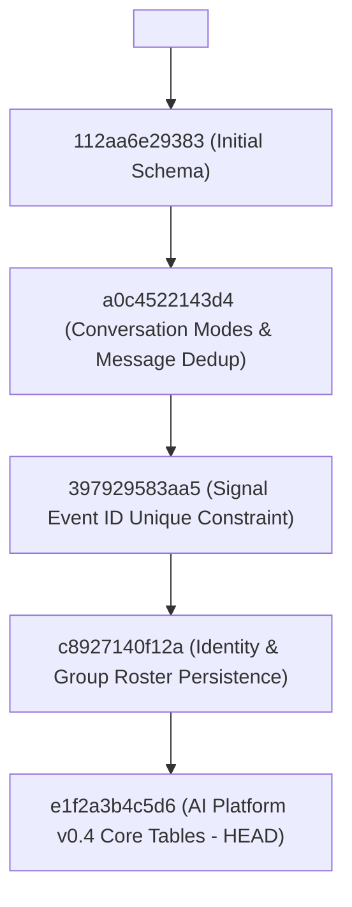

# Database Migration Guide

## Overview

The project uses [Alembic](https://alembic.sqlalchemy.org/) for async SQLite/PostgreSQL schema migrations via `aiosqlite`.
All database changes follow a strict linear migration chain from `<base>` to current `head`.

> [!IMPORTANT]
> Fresh installations run `alembic upgrade head` directly against an empty database. Do **not** use `alembic stamp head` or manual schema creation.

---

## Migration Revision Chain

The verified linear revision chain:



### Detailed Revisions

| Revision | Down Revision | Description |
|---|---|---|
| `112aa6e29383` | `<base>` | Initial schema baseline (`users`, `conversations`, `messages`, `groups`, `products`, `bot_config`, `audit_logs`, `campaign_delivery_logs`). |
| `a0c4522143d4` | `112aa6e29383` | Added `conversations.mode`, `groups.description`, `messages.sender_name`, `signal_timestamp_ms`, `signal_event_id`, `delivery_status`, `delivery_error`. |
| `397929583aa5` | `a0c4522143d4` | Applied `UNIQUE(signal_event_id)` batch constraint; dropped legacy `intent_confidence`. |
| `c8927140f12a` | `397929583aa5` | Round 2 identity expansion (`canonical_user_id`, UUID/phone mapping, `group_members` roster table, `message.origin`). |
| `e1f2a3b4c5d6` | `c8927140f12a` | **AI Platform v0.4**: Added tables for `ai_runs`, `ai_suggestions`, `knowledge_sources`, `knowledge_documents`, `knowledge_chunks`, `durable_memories`, `skills`, `feedback_events`, `learning_candidates`. |

---

## Applying Migrations

### 1. Fresh Install

On a new empty database:

```bash
cd backend
alembic upgrade head
```

Or via Docker Compose:

```bash
docker compose exec backend alembic upgrade head
```

### 2. Upgrading Existing Database (v0.3 → v0.4)

Before upgrading any production database, always create a timestamped backup:

```bash
# 1. Backup production database
cp data/bot.db data/bot.db.backup.$(date +%Y%m%d_%H%M%S)

# 2. Run upgrade to head
cd backend
alembic upgrade head

# 3. Verify current revision is at head
alembic current
```

Expected output of `alembic current`:
```text
e1f2a3b4c5d6 (head)
```

### 3. Verifying Migration Chain

Check migration history:

```bash
alembic history --verbose
```

Inspect heads:

```bash
alembic heads
```

---

## Rollback Policy

To downgrade one step:

```bash
alembic downgrade -1
```

To downgrade back to the v0.3 head:

```bash
alembic downgrade c8927140f12a
```

---

## Architectural Rules & Guarantees

1. **SQLite Batch Mode**: All column alterations, index additions, and constraint drops MUST use `batch_alter_table` to guarantee SQLite compatibility.
2. **Zero Data Loss**: Existing columns and rows are strictly preserved during upgrade. Nullable columns and safe defaults are provided for backward compatibility.
3. **Never Stamp Head on Fresh DB**: Running `Base.metadata.create_all()` followed by `stamp head` is deprecated. Always use `alembic upgrade head` so the migration log matches schema state.
