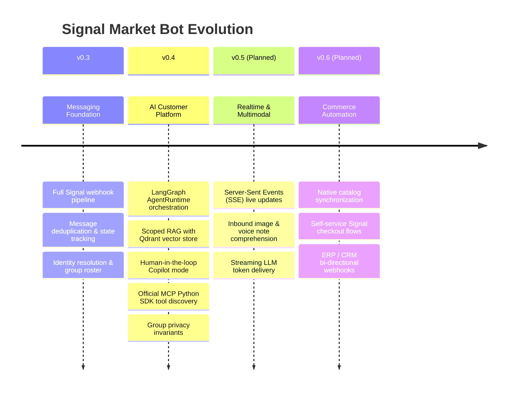

# Product Roadmap

## Milestone Overview

---

## Versions

### [v0.3.0] — Production Messaging Foundation (Released)
- Signal gateway integration via `signal-cli-rest-api`.
- Asynchronous database layer with SQLite and Alembic migrations.
- Contact synchronization, group rosters, and administrative manual takeover.

### [v0.4.0] — AI Customer Service Platform (Released)
- Unified `AgentRuntime` for both Auto and Copilot modes.
- Production adapter wiring (OpenAI-compatible LLM/Embedding, Qdrant vector store).
- Strict Group Privacy Invariant: Group contexts never leak private user notes or memories.
- Official `mcp` SDK stdio integration with administrative governance.
- Deterministic Agent Contract Evaluation Suite (32 cases, 100% decision accuracy).
- Scoped durable memory and progressive skill loading.

### [v0.4.1] — AI Studio Observability & Operations (Current Release)
- AI Studio unified management console (Overview, Runs, Knowledge, Memory, Skills, MCP, Learning, Prompts, Evals, Diagnostics).
- Truthful multi-source token usage & cost telemetry (`provider`, `estimated`, `unavailable`, `partial`).
- Model call tracking with latency breakdown, reasoning tokens, and failed tool attempt observability.
- MCP client lifecycle management with automatic tool unregistration upon disconnect.
- Learning curation idempotency with database-level uniqueness constraints.
- Evaluation sandbox isolation preventing customer conversation contamination.

### [v0.5.0] — Realtime & Multimodal Intelligence (Planned)
- Server-Sent Events (SSE) for instantaneous inbox and notification updates.
- Inbound attachment processing (receipt OCR, product image inspection).
- Streaming token completion to the frontend Copilot editor.

### [v0.6.0] — Commerce Automation & Integrations (Planned)
- Conversational cart management and checkout link dispatch.
- Multi-currency price catalog with automated inventory holds.
- Webhook notifications for external CRM/ERP synchronization.
